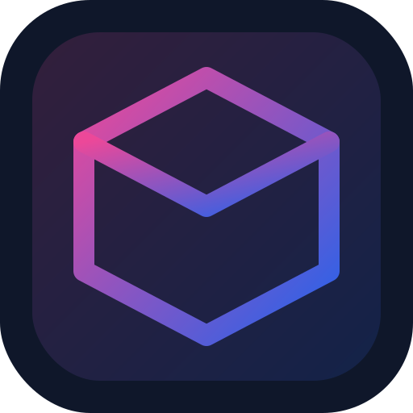

<div align="center">



# MAI-Background

**Elimina el fondo de tus videos con precisión — directo en el navegador.**

Sube un video de una persona, quita o reemplaza el fondo en tiempo real y crea
montajes graciosos y originales. Sin subir nada a un servidor.

[· Demo en vivo ·](https://mai-software.github.io/MAI-Background/) · PWA instalable · 100% local

</div>

---

## ✨ Qué hace

- **Eliminación de fondo en tiempo real** de personas, cuadro a cuadro, con IA ([MediaPipe Selfie Segmentation](https://google.github.io/mediapipe/solutions/selfie_segmentation)).
- **Fondos a elegir:**
  - 🫥 **Transparente** (canal alfa)
  - 🎨 **Color** sólido (con presets, incluido verde croma)
  - 🌫️ **Desenfoque** del fondo original
  - 🖼️ **Imagen** propia
  - 🎬 **Otro video** de fondo
- **Suavizado de bordes** ajustable.
- **Exporta a WebM** conservando el audio original (`MediaRecorder`).
- **PWA**: instalable como app de escritorio o móvil, funciona offline.
- **Privacidad total**: el video nunca sale de tu dispositivo.

## 🚀 Uso

1. Abre la [demo](https://mai-software.github.io/MAI-Background/) (o sirve la carpeta localmente).
2. Arrastra un video donde aparezca una persona.
3. Elige el tipo de fondo en el panel derecho.
4. Pulsa **Grabar y exportar** y deja que se reproduzca de inicio a fin.
5. Descarga tu `.webm`.

> Optimizado para clips con **una persona** (selfie, baile, presentación). El modelo separa a la persona del fondo.

## 🛠️ Tecnología

| Capa | Detalle |
|------|---------|
| UI | HTML + CSS (sin framework), tema Dark OLED, tipografía Inter |
| IA | MediaPipe Selfie Segmentation (vía CDN, WASM/GPU en el navegador) |
| Render | `<canvas>` 2D con compositing (`source-in` / `destination-over`) |
| Export | `canvas.captureStream()` + `MediaRecorder` (VP9/VP8 + audio) |
| App | PWA (manifest + service worker, offline-first) |

No requiere build. Es HTML/CSS/JS estático.

## 💻 Desarrollo local

Necesita servirse por HTTP (el service worker y los módulos no funcionan con `file://`):

```bash
# Python
python -m http.server 8080
# o Node
npx serve .
```

Luego abre `http://localhost:8080`.

## 🌐 Despliegue (GitHub Pages)

El repo se publica desde la rama `main` (raíz). Una vez activado Pages:

```
https://mai-software.github.io/MAI-Background/
```

## ⚠️ Compatibilidad

- Chrome / Edge / navegadores Chromium: soporte completo (recomendado).
- Firefox: soportado (`mozCaptureStream`).
- Safari: la segmentación funciona; el formato de exportación WebM puede variar.

## 📄 Licencia

[MIT](LICENSE) © MAI Software
